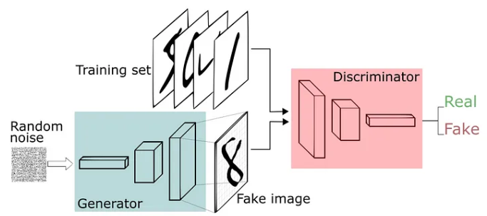
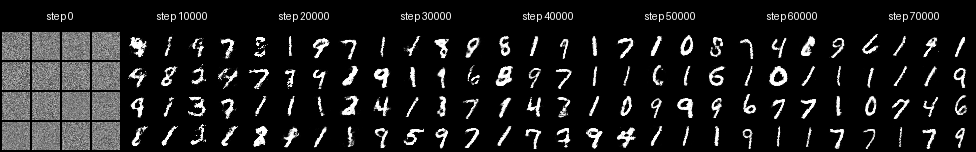

# GAN_from_scratch

## Introduction

Pytorch版本实现的基于MNIST的生成对抗网络(仅供学习)

## Preliminary

- **GAN-architecture**

## generated_images

## Acknowledgements

- [Generative Adversarial Nets](https://arxiv.org/pdf/1406.2661)
- [GAN原理讲解与PyTorch手写逐行讲解](https://www.bilibili.com/video/BV1VT4y1e796/?spm_id_from=333.1007.top_right_bar_window_history.content.click&vd_source=634f9cd56b5b0cf10f6976238630bd8d)